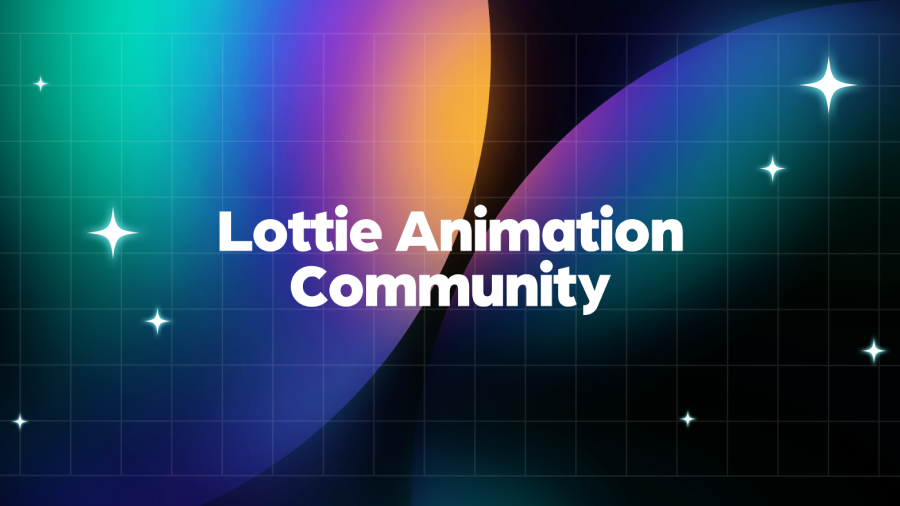

We are excited to announce the Lottie Animation Community (LAC), a non-profit open source project hosted by The Linux Foundation, dedicated to establishing the Lottie File Format as an efficient, scalable and cross-platform animated vector graphics technology and open file format.The evolution and prevalence of Lottie has prompted the need for a formal format specification and democratic change mechanism, to help developers and consumers of the format ensure reliable performance and compatibility across the diverse platforms on which Lottie is used.

LAC was founded by a community of pioneers in recognition of that need. LAC aims to develop a formal Lottie format specification for implementation across renderers and other tools, and works towards the promotion and widespread adoption of the Lottie file format as an industry standard.

LAC operates as a project under the governance of the Joint Development Foundation, guaranteeing an open, collaborative approach to our standardization efforts. Our work is deeply rooted in transparency, ensuring that everyone in our community has a voice in the development and refinement of the Lottie File Format.

The current LAC steering committee members are Hernan Torrisi, Google, LottieFiles, Airbnb, Salih Abdul-Karim and Gabriel Peal. Our community is growing with new members joining who share our commitment to the advancement of the Lottie File Format.

We invite like-minded organizations and individuals to join us at [https://github.com/lottie-animation-community](https://github.com/lottie-animation-community).

Together, we can make the digital world a more animated place.
